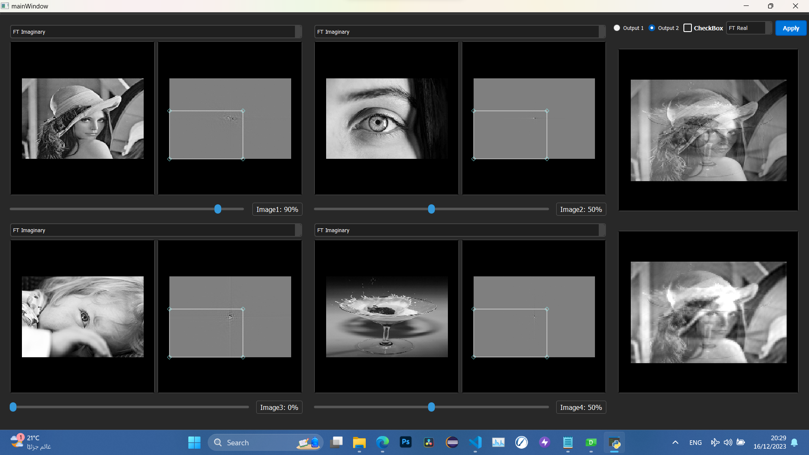
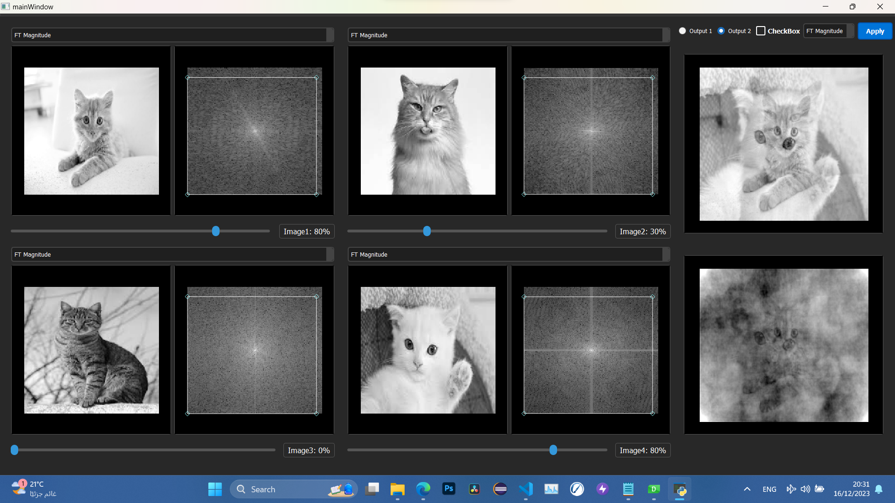

# Fourier Transform Mixer

## Overview
The Fourier Transform Mixer is a sophisticated tool designed for efficient and intuitive handling of Fourier transforms. This utility is particularly beneficial for individuals engaged in signal processing, audio engineering, and other scientific applications where Fourier analysis is pivotal.

## Features
- **Fast Fourier Transform (FFT) Integration:** Enables quick and accurate computation of Fourier transforms.
- **Signal Visualization:** Provides graphical representations of input and transformed signals.
- **User-Friendly Interface:** Designed for ease of use, regardless of the user's expertise in Fourier analysis.
- **Customizable Parameters:** Allows users to adjust key settings for precise analysis.
- **Comprehensive Documentation:** Detailed instructions and examples to help users get started.

  

  

## Team Members:  
1- Fady Mohsen  
2- Ahmad Mahmoud  
3- Shehab Mohamad  
4- Mohamad Aziz  

